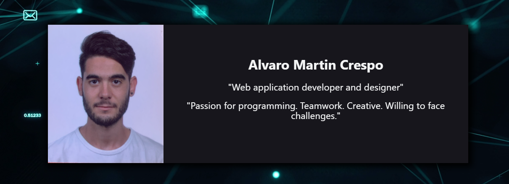

# Hi, I’m @AlvaroMartinCrespo 💻💻

## Desarrollador Web y Apasionado por ReactJS

¡Hola! Soy un desarrollador web graduado en desarrollo de aplicaciones web con experiencia en el uso de tecnologías como HTML, CSS, JavaScript (jQuery) y PHP. También soy un apasionado de aprender y me considero autodidacta.

Durante mis 3 meses de experiencia laboral como desarrollador web, he trabajado en diversos proyectos donde he utilizado estas tecnologías para crear aplicaciones y páginas web. Mi objetivo es seguir desarrollando mis habilidades como desarrollador frontend o full-stack.

Además de mis proyectos profesionales, también dedico tiempo a explorar y aprender nuevas tecnologías. Me he sumergido en el mundo de ReactJS y Next.js, donde he creado proyectos de aplicaciones y páginas web. Disfruto especialmente trabajar con ReactJS, ya que ofrece una experiencia de desarrollo dinámica y eficiente.

Si quieres conocer más sobre mis proyectos y explorar mi trabajo, visita mi página web donde encontrarás una muestra de mis proyectos. Estoy emocionado por seguir aprendiendo y creando aplicaciones web emocionantes y de alta calidad.

¡Gracias por visitar mi perfil!

# Find me around the web🌍:
 - [Portfolio](https://devalvaro.vercel.app/)
 - [LinkedIn](https://www.linkedin.com/in/%C3%A1lvaro-mart%C3%ADn-crespo-bb9aa5246/)

